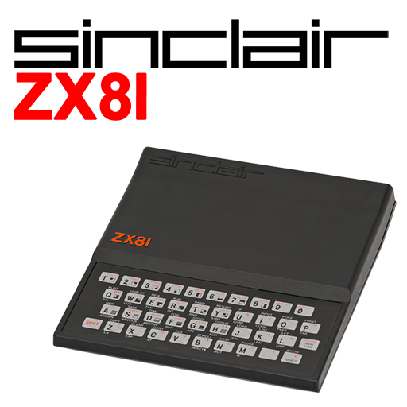

# Sinclair - ZX 81 (EightyOne)

### Description

EightyOne is an emulator for the range of home computers made by Sinclair Research (and their clones) in the 1980s.

### License

GPLv3

### Icon

### Fanart

Help make me fanart!

### Screenshots

Help make me screenshots!
